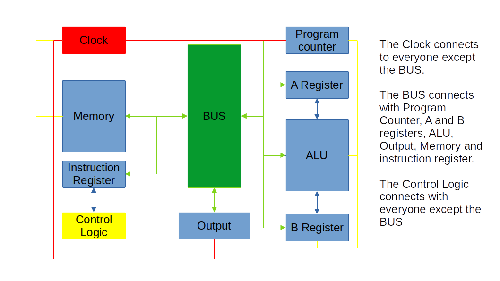

This project trys to simulate an 8 bit processor.

It will have all components (clock, registers, bus, ALU, memory, and controller) attacked to each other as in a real processor.

The following image shows all the iterations

